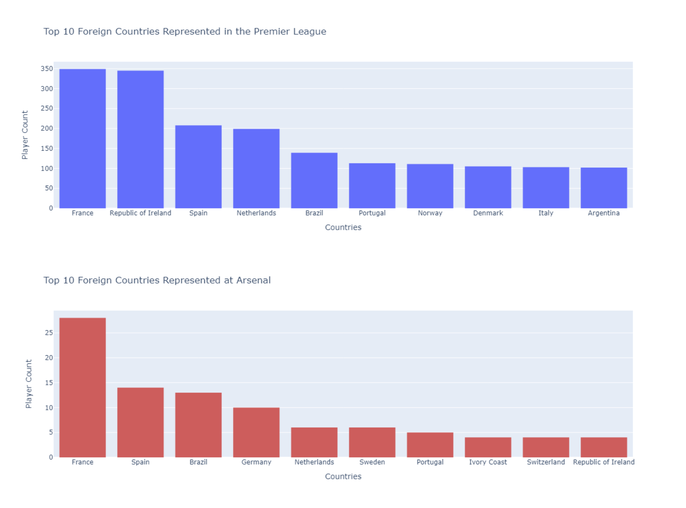

# Web Scraping, Parsing and Visualization in Python

This is an ongoing project where the Wikipedia page [List of foreign Premier League players](https://en.wikipedia.org/wiki/List_of_foreign_Premier_League_players) is parsed into the following dataset containing information about 2709 international players between 1992 and 2024 in the English Premier League.

 

Python libraries are used for data parsing, analysis, and visualization throughout the project..

- The **Create_Dataset.ipynb** notebook parses the HTML file and creates the **dataset.csv** file. It contains a combination of direct and derived fields. The **arsenal.csv** file is used to extract data specific to Arsenal players.
- **EDA_Visualization.ipynb** contains analysis and visualization of the data. Pandas and Plotly Express Python libraries have been used for the visualization.
- **app.py** is a basic Dash app to visualize the dataset and interactive plots.
- **html.txt** contains the HTML content from the Wikipedia page.

### Installation

1. Clone the repository:

`git clone https://github.com/rara-by/WikiTableQA.git`

2. Install the required Python libraries:

`pip install -r requirements.txt`

#### Note
The HTML content of the web page may change with time. In order to recreate the same dataset please use **html.txt**.

